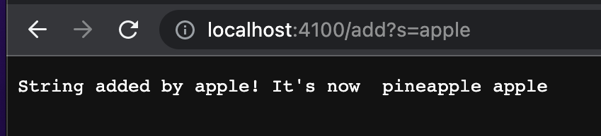

# Lab Report 2 – Servers and Bugs


**🌟Part 1: Simeplest Search Engine from week 2**
Here is the code for Search Engine
```
import java.io.IOException;
import java.net.URI;

class Handler implements URLHandler {
    // The one bit of state on the server: a number that will be manipulated by
    // various requests.
    String str = "";

    /* (non-Javadoc)
     * @see URLHandler#handleRequest(java.net.URI)
     */
    /* (non-Javadoc)
     * @see URLHandler#handleRequest(java.net.URI)
     */
    public String handleRequest(URI url) {
        if (url.getPath().equals("/")) {
            return String.format("String: %s", str);
        } 
        else if (url.getPath().contains("/search")) {
            String[] parameters = url.getQuery().split("=");
            String[] subStr = str.split(" ");
            String targetStr = "";
            for (int i = 0; i < subStr.length; i++){
                if (subStr[i].contains(parameters[1]))
                    targetStr = targetStr + " " + subStr[i];
            }
            return targetStr;
        } else {
            System.out.println("Path: " + url.getPath());
            if (url.getPath().contains("/add")) {
                String[] parameters = url.getQuery().split("=");
                if (parameters[0].equals("s")) {
                    str = str + " " + parameters[1];
                    return String.format("String added by %s! It's now %s", parameters[1], str);    
                }
            }
            return "404 Not Found!";
        }
    }
}

class SearchEngine {
    public static void main(String[] args) throws IOException {
        if(args.length == 0){
            System.out.println("Missing port number! Try any number between 1024 to 49151");
            return;
        }

        int port = Integer.parseInt(args[0]);

        Server.start(port, new Handler());
    }
}

```


-Which methods in your code are called
```
if (url.getPath().contains("/add")) {
    String[] parameters = url.getQuery().split("=");
    if (parameters[0].equals("s")) {
        str = str + " " + parameters[1];
        return String.format("String added by %s! It's now %s", parameters[1], str);    
    }
}
```
These lines of code will get called since I'm having `/add` in my url, and it will add the string after = to my str.

-What the values of the relevant arguments to those methods are, and the values of any relevant fields of the class

The value of relevant arguments are `pineapple`,  and `pineapple` will be store in `parameters[1]`.

-If those values change, how they change by the time the request is done processing

The original `str` was empty, and when I add `/add?s=pineapple` on the url, `String[] parameters = url.getQuery().split("=");`, will put anything after `=` into `parameter[1]` and the rest into `parameter[0]`. The value that in `parameters[1]` will be changed to `pineapple` since `=` is followed by `pineapple`.  `str = str + " " + parameters[1];` will add `pineaaple` to my str, now the str change from empty to `pieapple`.


Same as above. 
```
if (url.getPath().contains("/add")) {
    String[] parameters = url.getQuery().split("=");
    if (parameters[0].equals("s")) {
        str = str + " " + parameters[1];
        return String.format("String added by %s! It's now %s", parameters[1], str);    
    }
}
```
These lines of code will get called since I'm having `/add` in my url, and it will add the string after = to my str.

-What the values of the relevant arguments to those methods are, and the values of any relevant fields of the class

The value of relevant arguments are `apple`,  and `apple` will be store in `parameters[1]`.

-If those values change, how they change by the time the request is done processing

The original `str` was `pineapple`, and when I add `/add?s=apple` on the url, `String[] parameters = url.getQuery().split("=");`, will put anything after `=` into `parameter[1]` and the rest into `parameter[0]`. The value that in `parameters[1]` will be changed to `apple` since `=` is followed by `apple`.  `str = str + " " + parameters[1];` will add `apple` to my str, now the str change from `pineapple` to `pieapple apple`.


I called search method to search a substring app. The string is pineapple apple, and after searching app, pineapple and apple were diplaied because they have the substring app.

```
else if (url.getPath().contains("/search")) {
    String[] parameters = url.getQuery().split("=");
    String[] subStr = str.split(" ");
    String targetStr = "";
    for (int i = 0; i < subStr.length; i++){
        if (subStr[i].contains(parameters[1]))
            targetStr = targetStr + " " + subStr[i];
    }
    return targetStr;
}
```

These lines of code will get called since I'm having `/search` in my url, and it will add the string after = to my str.

-What the values of the relevant arguments to those methods are, and the values of any relevant fields of the class

The value of relevant arguments are `app`,  and `app` will be store in `parameters[1]`.

-If those values change, how they change by the time the request is done processing

My `str` was `pineapple apple`, and when I add `/search?s=app` on the url, `String[] parameters = url.getQuery().split("=");`, will put anything after `=` into `parameter[1]` and the rest into `parameter[0]`. The value that in `parameters[1]` will be changed to `app` since `=` is followed by `apple`.  

```
for (int i = 0; i < subStr.length; i++){        
    if (subStr[i].contains(parameters[1]))
        targetStr = targetStr + " " + subStr[i];
    }
}
```
Thses lines of code will get called to check if the substring in my str contains `app` or not, if the yes, it will add the that targetStr. 


**🌟Part 2: Bugs**

*Array Methods
-The failure-inducing input (the code of the test)


-The symptom (the failing test output)


-The bug


-the fixed Code


The test failed because of the AssertionError, which is because of the expected value different from the return value.

The bug for reversed was `newArray[arr.length - i - 1]`in `arr[i] = newArray[arr.length - i - 1]`, it make the original array to store the new array, and didn't story any in the new array.  This bug causes the symptom that the new array is not contain the expected vlues.

The code supppoed to create a new array to store the reversed array, but the bug makes the old array copy the new array’s value which has nothing on it yet. so the input is {4,2} and the expected output should be {2,4}, but the actul output is 0 which is empty, this casusing the symptom that the excepted output and actul output is not equal.


*List Methods
-The failure-inducing input (the code of the test)


-The symptom (the failing test output)


-The bug


-the fixed Code


The bug for reversed was `add(0,s)`in `result.add(0,s);`, it make the s added to the first position of the result array, which should be added to the end of the array.  This bug causes the symptom that the elements in output array is not stored in the position that we want.

The code supppoed to add the matched string to the result list in the same order that it is in the origital list, The bug makes s added to the begining of the result list. The input was `apple` and `banana`, it should be add `apple` and then add `banana`, to make the result list is {"apple", "banana"}. But the bug add s to the begining of reslut list. When we add `apple` to the result list, `apple` was added to the begining of reslut list, this is ok because the reslut list is empty. Then, when we add `banana` to the result list, `banana` was added to the begining of the result list, this is NOT ok because it made the result list become `banana, apple` which is not the order we exepted (`appple, banana`).


