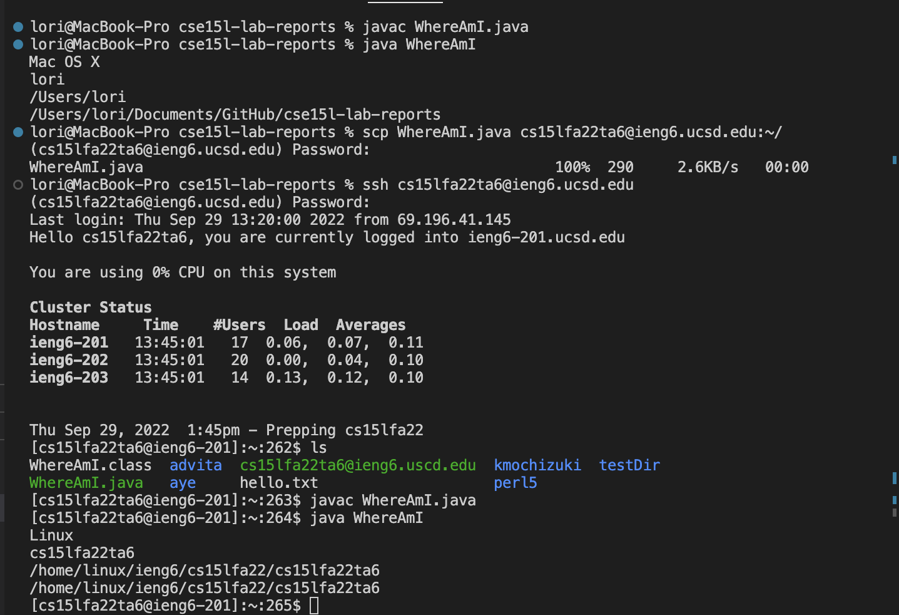

# Week 1 – Remote Access and the Filesystem


**🌟Part 1: Installing VScode**
Go to VScode's [website](https://code.visualstudio.com/) and download it.

It only works on Windows, OSX, and linux. (If you only have tablet or non of those system's computer, don't download it, it won't work.)


**🌟Part 2: Remotely Connecting**
Many CSE courses use course-specific account. You can look up your course-specific account over [here](https://sdacs.ucsd.edu/~icc/index.php)

It's initial password is your AD password, and we will need to change it.


For student who are on windows:
Install OpenSSH on [here](https://learn.microsoft.com/en-us/windows-server/administration/openssh/openssh_install_firstuse?tabs=gui)


open a terminal on VSCode and login to the account.
it should look like this, but replace zz with your specific account.
```
$ ssh cs15lfa22zz@ieng6.ucsd.edu
```

For people who are the first time connected to this server, it will show up a question:
`Are you sure you want to continue connecting (yes/no/[fingerprint])?`


Just type `yes` and enter.
After login sucessfully, it would look like this:


**🌟Part 3: Trying Some Commands**

Now we're on the remote computer. Try to run some coomands.


We can log out the server by two ways: Ctrl-D or using command "exit"


**🌟Part 4: Moving Files with scp**

* Frist step: 
create a local file called WhereAmI.java and put the following contents into it:
```
class WhereAmI {
  public static void main(String[] args) {
    System.out.println(System.getProperty("os.name"));
    System.out.println(System.getProperty("user.name"));
    System.out.println(System.getProperty("user.home"));
    System.out.println(System.getProperty("user.dir"));
  }
}
```

then compile and run it by the follwing:
```
javac WhereAmI.java
java WhereAmI
```
Sometime we are now on the right directory yet, just use the command
```
cd /direction of the file/ (don't include the file)
```
* Second step: 
Using the command `scp` to copy the file that on your computer to the remote computer.

```scp WhereAmI.java cs15lfa22zz@ieng6.ucsd.edu:~/```

Then it will ask you your password. After you entering the correct password, the file will be on the remote computer.

* Third step:
login into the remote computer and use ls to see if the file is on the directory.
Use the same command javac and java as before to run the the program.




**🌟Part 5: Setting an SSH Key**

* First step:
Type `ssh-keygen` on local computer
When it shows 
```
Enter file in which to save the key (/Users/joe/.ssh/id_rsa):
```

Enter `/Users/joe/.ssh/id_rsa`

Then it will shows: 
```
Enter passphrase (empty for no passphrase): 
```

Press `enter` here, don't write anything.

Enter same passphrase again:  enter again.

* Second step: 
1. login into the remote computer again (on local computer)
2. enter "mkdir .ssh" on the remote computer (on remote computer)
3. logout
4. enter `/Users/joe/.ssh/id_rsa.pub cs15lfa22zz@ieng6.ucsd.edu:~/.ssh/authorized_keys` (on local computer)
5. enter password.


After all these steps, now you no need to enter password to login into the remote computer.


**🌟Part 6: Optimizing Remote Running**

1. We can add command in quotes at the end of an ssh to directly run it on the remote computer, then exit.
```
$ ssh cs15lfa22zz@ieng6.ucsd.edu "ls"
```


2. We can also use semicolons to run multiple commands on the same line.
$ javac WhereAmI.java; java WhereAmI

