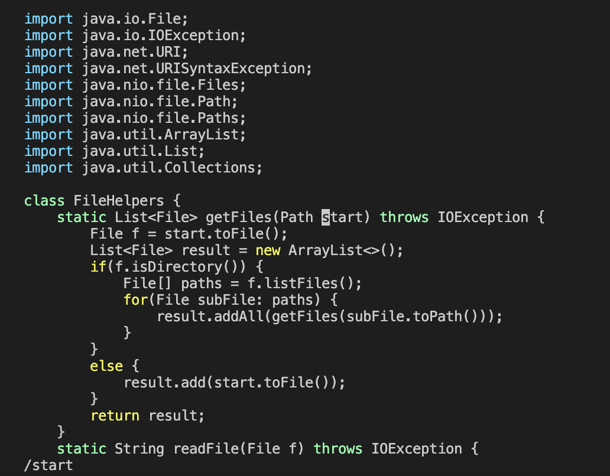
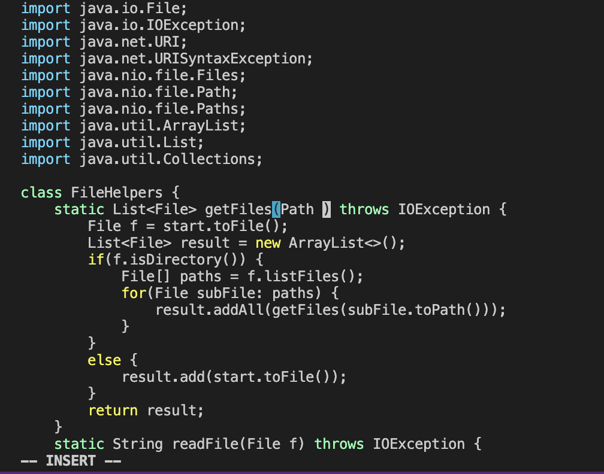
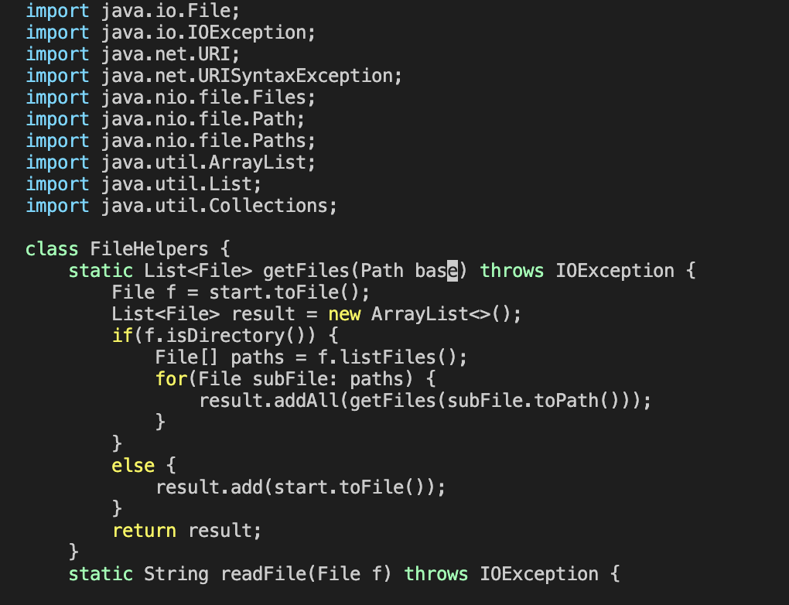
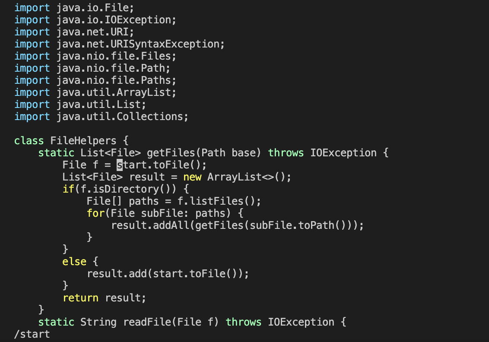
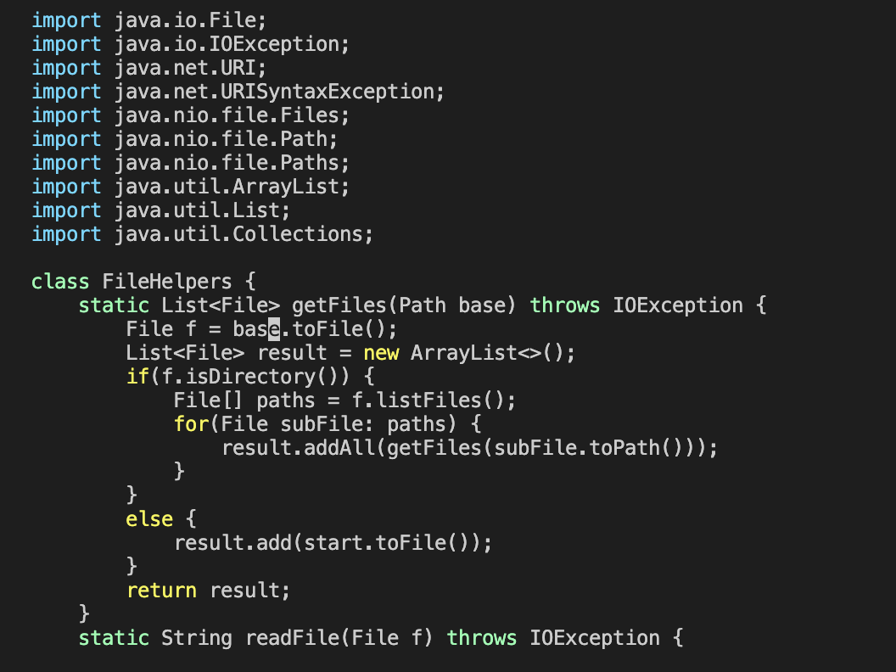
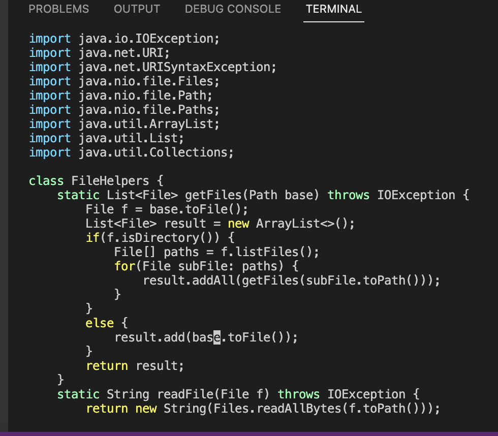
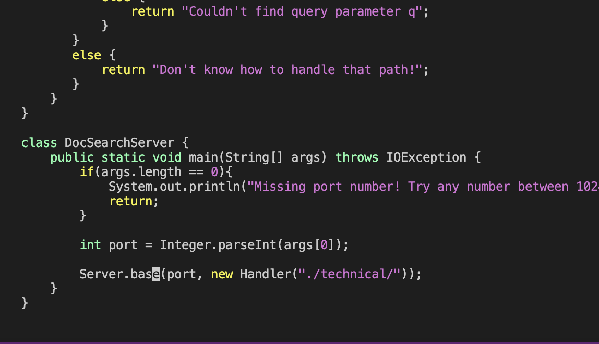
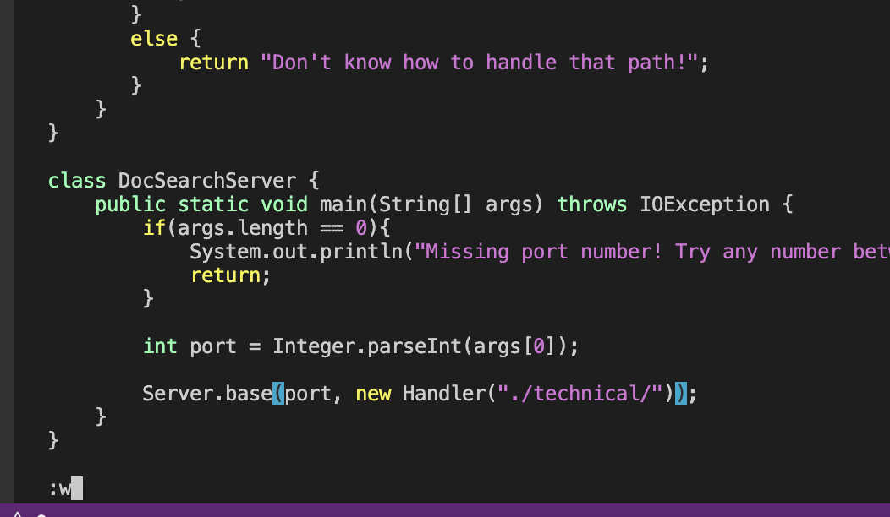
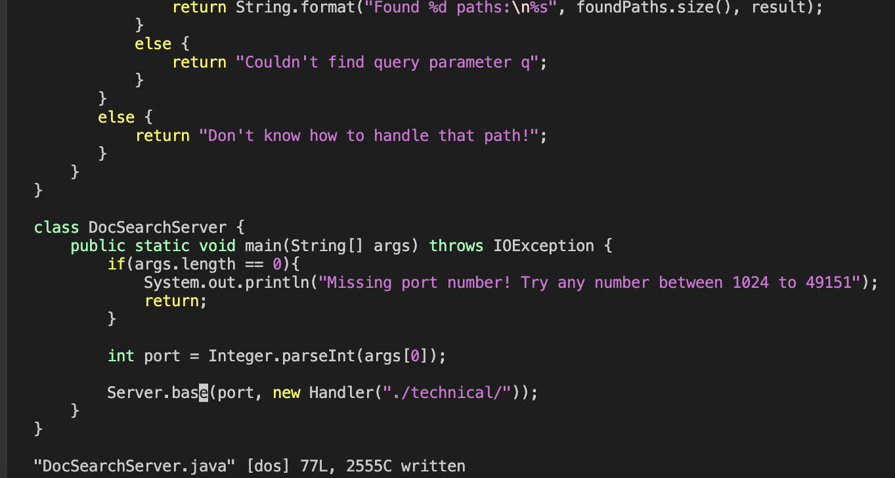

# Lab Report 4

**Part 1**
Changing the name of the start parameter and its uses to base

`/start<Enter>cgnbase<Esc>n.n.n.:w<Enter>`
* `/start<Enter>` cursor jumping to the start of `start`.

* `ce` deleting the word `start` and switching into insert mode.

* `base<Esc>` replacing the text and returning to normal mode.

* `n` will find next `start` and press `.` will repeat the last change I made.

* `:w<Enter>` will save the changes.

**Part 2**

* Which of these two styles would you prefer using if you had to work on a program that you were running remotely, and why?

Using scp took me 3 mintues to complete the work, yet using vim only took me 1 minute to complete the work. When I was using scp, the waiting time took a while, and the most difficulty is to find the `start` because there is a lot of content on the file, and I had to read line by line which is inconvenient.
I will use the sceond way, which is using vim.The reason I'm using vim is because I don't need to download the program back and forth. It saves my time.

* What about the project or task might factor into your decision one way or another? (If nothing would affect your decision, say so and why!)

The size of the project will be the factor of my decision. If the project is too big, I don't want to download the project in local computer at all. Also the steps and time wasted. 
