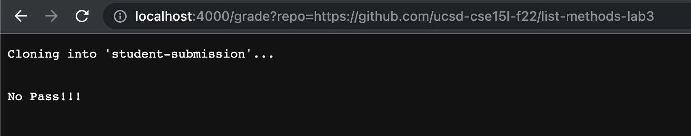
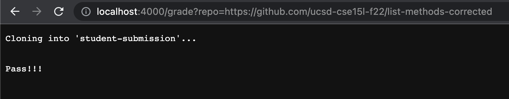
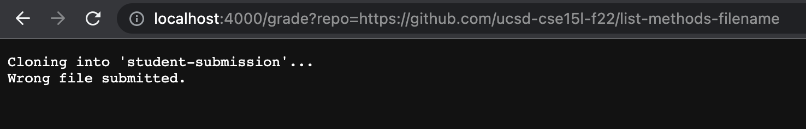

** Lab Report 5**
```
#set -e

CPATH=".:lib/hamcrest-core-1.3.jar:lib/junit-4.13.2.jar"
rm -rf student-submission
git clone $1 student-submission
cd student-submission/
if [[ -f ListExamples.java ]]
then 
    echo ""
else
    echo "Wrong file submitted."
    exit
fi

cd list-examples-grader/
cp student-submission/ListExamples.java ./


javac -cp $CPATH *.java 2> compile-err.txt > out.txt

if [[ $? -eq 0 ]]
then 
    echo ""
else 
    echo "Compile error."
    exit
fi

java -cp $CPATH org.junit.runner.JUnitCore TestListExamples 2> err.txt > out.txt
#grep -c "FAILUTRE!!!" out.txt > result.txt
if [[ $? -eq 0 ]]
then 
    echo "Pass!!!"
    exit
else 
    echo "No Pass!!!"
fi

```




---
* THIRD SCREENSHOT


`rm -rf student-submission`        standard output:                                           standard error:       Exit code: 0
`git clone $1 student-submission`  standard output: Cloning into 'student-submission'...      standard error:       Exit code: 0
`cd student-submission/`           standard output:                                           standard error:       Exit code: 0
`echo "Wrong file submitted."`     standard output: Wrong file submitted.                     standard error:       Exit code: 0


In the third screenshot,`if [[ -f ListExamples.java ]]` the condition is false because wrong file/file-name was submitted. When grade.sh check if ListExamples.java exsit or not in student-submission, because it cannot find the file named ListExamples.java, it return false.


The line `echo ""` which comes after `if [[ -f ListExamples.java ]]` isn't run because `if [[ -f ListExamples.java ]]` is flase.
```
cd list-examples-grader/
cp student-submission/ListExamples.java ./


javac -cp $CPATH *.java 2> compile-err.txt > out.txt

if [[ $? -eq 0 ]]
then 
    echo ""
else 
    echo "Compile error."
    exit
fi

java -cp $CPATH org.junit.runner.JUnitCore TestListExamples 2> err.txt > out.txt
#grep -c "FAILUTRE!!!" out.txt > result.txt
if [[ $? -eq 0 ]]
then 
    echo "Pass!!!"
    exit
else 
    echo "No Pass!!!"
fi
```
All these line won't run because the program exit early on below code becase wrong file was submitted, so the program print out Wrong file submitted then exit.
```
if [[ -f ListExamples.java ]]
then 
    echo ""
else
    echo "Wrong file submitted."
    exit
fi
```
